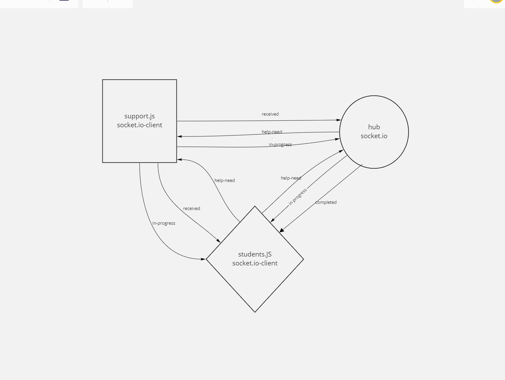

# LAB - Class 14

## Project: Event Driven Applications

### Author: Nassir Abegas, Kale Lesko

### Links and Resources

- [ci/cd](https://github.com/Saynka/lab14hub/actions) (GitHub Actions)
- [back-end server url](http://xyz.com) (when applicable)
- [front-end application](http://xyz.com) (when applicable)

### Setup

.
├── LICENSE
├── README.md
├── assets
├── hub
│ ├── **tests**
│ │ └── hub.tests.js
│ ├── hub.js
│ ├── package-lock.json
│ └── package.json
├── students
│ ├── **tests**
│ │ └── students.tests.js
│ ├── package-lock.json
│ ├── package.json
│ └── students.js
└── support
├── **tests**
│ └── support.tests.js
├── package-lock.json
├── package.json
└── support.js

#### `.env` requirements (where applicable)

- `PORT=3000`
- `dotenv`
- `faker`
- `jest`
- `socket.io`
- `socket.io-client`

#### How to initialize/run your application (where applicable)

##### hub

- `npm init -y`
- `node hub.js`

##### students

- `npm init -y`
- `node students.js`

##### support

- `npm init -y`
- `node support.js`

#### How to use your library (where applicable)

- `3 seperate apps all require their own dependences`

#### Tests

- tests run from ci/di

#### UML

